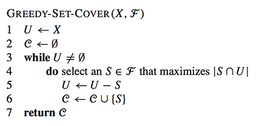

# Cobertura de conjunto gananciosa

### **Definição de problema**

No problema de cobertura de conjunto, temos um universo U, tal que | U | = n, e conjuntos S1, ..., Sk ⊆ U. Uma cobertura de conjunto é uma coleção C de alguns dos conjuntos de S1, ..., Sk cuja união é todo o universo U. Formalmente, C é uma cobertura de conjunto se S Si∈C Si = U. Gostaríamos de minimizar | C |.

### **Pseudo-código**

